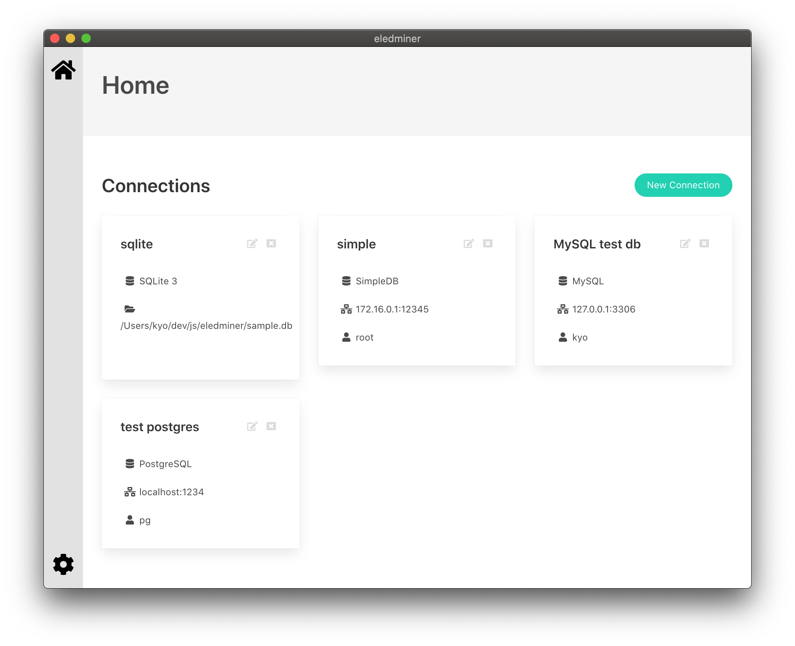
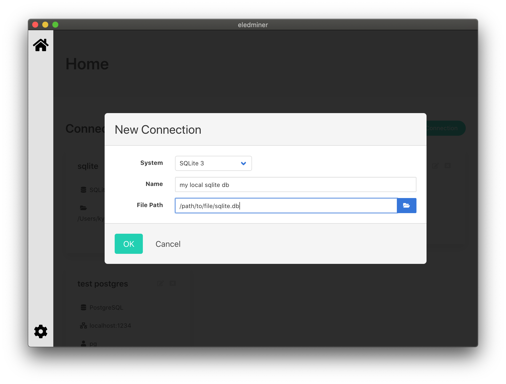

eledminer
====

Desktop application for database management with [Electron](https://www.electronjs.org/) and [Adminer](https://www.adminer.org/)


## About

> This app is under development...

Eledminer is the Electron application to manage and connect to the Adminer launched locally.

The application starts the php server as local background process and runs Adminer on it, and manage databases using Electron's BrowserView.

### Supported

- MySQL
  - TCP/IP connection
- SQLite

### Not supported yet

- MySQL
  - using SSL
  - socket/pipe
  - over SSH
- other databases
  - might work, but not tested

## Features / Screenshot

### Connections management

Eledminer makes it easy to save and manage connections.



### SQLite

You can open SQLite database by simply specifying the file path.



## Installation / Development

```
$ npm install
$ npx elm install
$ npm run build
$ npm start
```

## Requirements

PHP 7+
