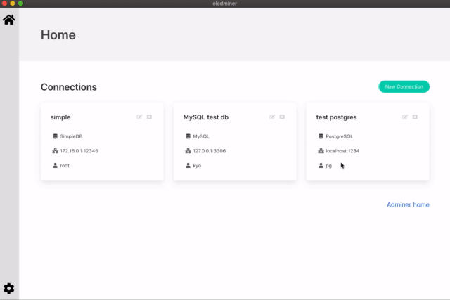

eledminer
====

Desktop application for database management with [Electron](https://www.electronjs.org/) and [Adminer](https://www.adminer.org/)



## About

> This app is under development...

Eledminer is the Electron application to manage and connect to the Adminer launched locally.

The application starts the php server as local background process and runs Adminer on it, and manage databases using Electron's BrowserView.

## Installation / Development

```
$ npm install
$ npm run build
$ npm start
```

## Requirements

PHP 7+
